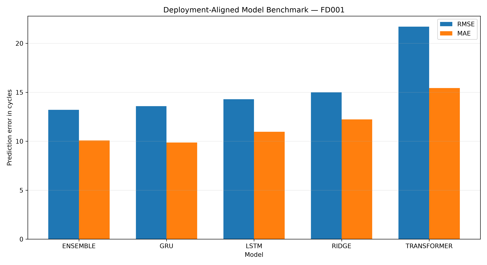
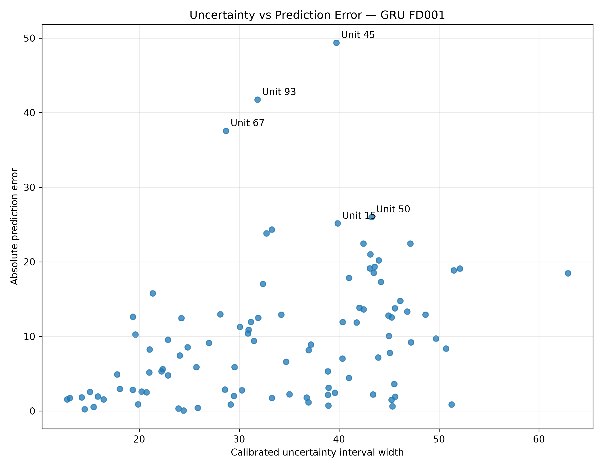
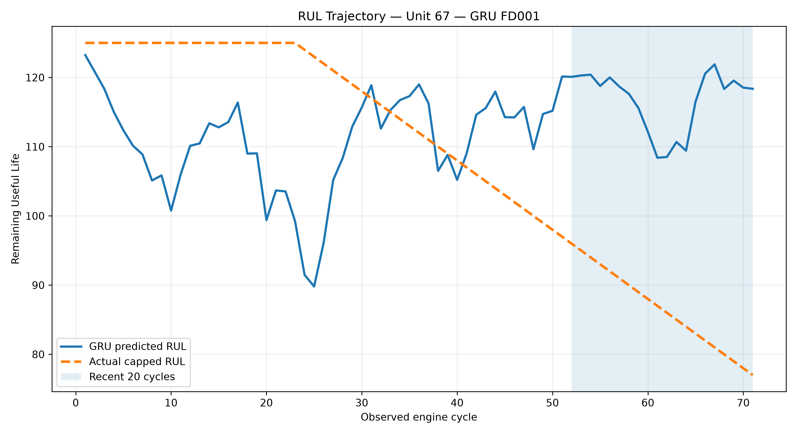
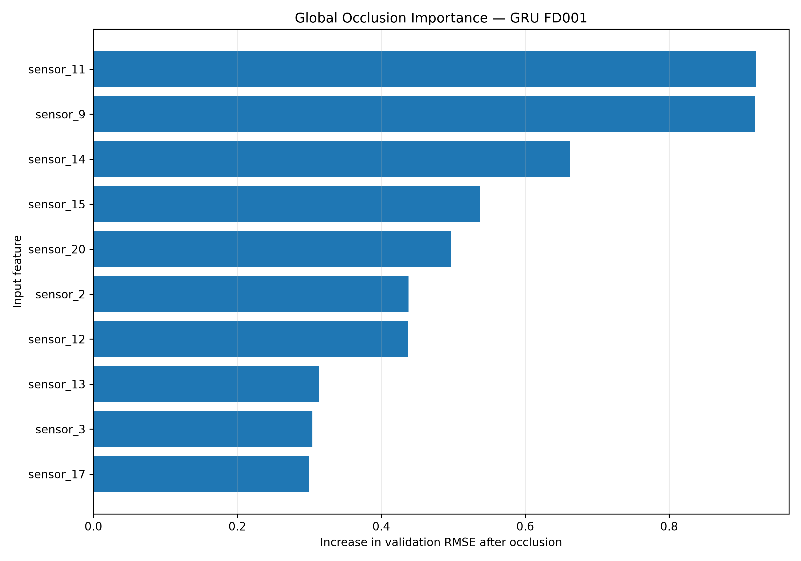
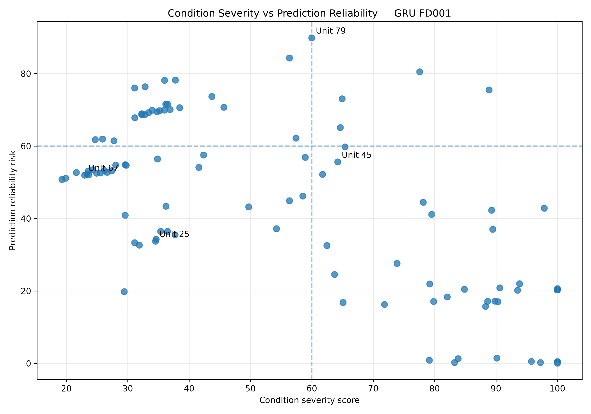
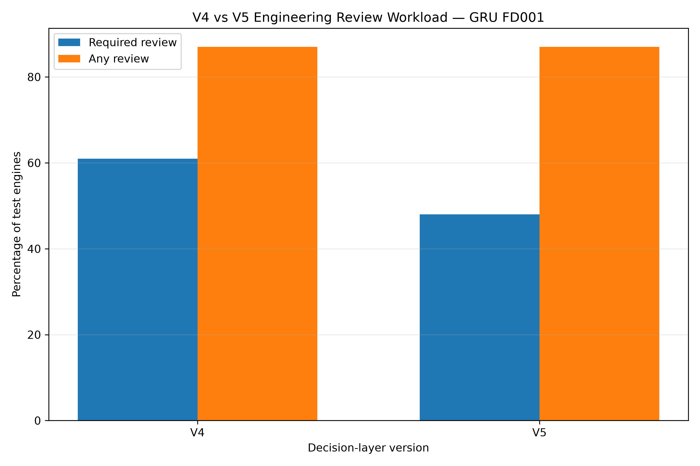

# MachineGuard AI

### Reliability-Aware Predictive Maintenance for Turbofan Engines

[](https://machineguard-ai.streamlit.app/)
[](https://www.python.org/)
[](https://streamlit.io/)
[](#dataset-and-problem-definition)
[](#project-status)
[](#license)

**MachineGuard AI** is an end-to-end predictive-maintenance research platform for estimating the **Remaining Useful Life (RUL)** of turbofan engines.

The project goes beyond training a neural network. It combines:

- leakage-safe preprocessing
- classical and deep-learning benchmarks
- deployment-aligned evaluation
- uncertainty calibration
- temporal trajectory diagnostics
- global and local explainability
- engineering review rules
- operational maintenance prioritisation
- an interactive multipage Streamlit dashboard

> **Live dashboard:**  
> https://machineguard-ai.streamlit.app/

---

## Why This Project Matters

A low prediction error alone does not make a predictive-maintenance model operationally trustworthy.

A model can:

- achieve strong average accuracy while overpredicting the life of individual engines
- agree with another model and still be wrong
- produce a confident-looking final estimate despite suspicious historical behaviour
- create excessive engineering-review workload
- hide important failure cases behind fleet-level metrics

MachineGuard AI therefore evaluates not only:

> **How accurate is the model?**

but also:

> **When should an engineer trust, question, or escalate its prediction?**

---

## Dashboard Experience

The Streamlit application provides two complementary ways to explore the project.

### Complete Dashboard — Full Project Story

A continuous long-form dashboard that reads like a technical report or book. It walks through the project from fleet-level results to individual-engine behaviour, uncertainty, explainability, decision validation, methodology, and limitations.

### Focused Technical Pages

- **Fleet Overview**
- **Engine Explorer**
- **Trajectory & Uncertainty**
- **Explainability**
- **Model Performance**
- **Decision Validation**
- **Methodology & Responsible Use**

---

## Key Results

All headline results use the NASA C-MAPSS **FD001** test fleet.

Each unseen test engine contributes exactly **one final prediction**, based on its latest available 30-cycle sequence.

| Model | RMSE | MAE | R² | NASA Score | Final Role |
|---|---:|---:|---:|---:|---|
| Ridge | 14.99 | 12.23 | 0.860 | 374.98 | Independent baseline |
| LSTM | 14.29 | 10.96 | 0.873 | 443.09 | Secondary sequence model |
| **GRU** | **13.58** | **9.88** | **0.885** | **317.71** | **Primary operational model** |
| Transformer | 21.70 | 15.43 | 0.706 | 1647.00 | Rejected for FD001 |
| **60% GRU + 40% LSTM** | **13.21** | **10.09** | **0.891** | **291.30** | Best aggregate accuracy |

### Improvement Over the Reproduced Original Pipeline

| Pipeline | RMSE | MAE | R² |
|---|---:|---:|---:|
| Reproduced original LSTM pipeline | 63.79 | 50.83 | -0.366 |
| MachineGuard AI GRU | 13.58 | 9.88 | 0.885 |
| MachineGuard AI ensemble | 13.21 | 10.09 | 0.891 |

The primary GRU reduced RMSE by approximately **78.7%** compared with the reproduced original LSTM result.

This improvement did not come from architecture alone. It came from correcting the full experimental methodology.

---

## Why the GRU Is the Primary Model

The GRU–LSTM ensemble achieved the best aggregate RMSE, R², and NASA score.

However, MachineGuard AI uses the **GRU as the primary operational model** because it offered the strongest standalone balance of:

- low RMSE
- lowest standalone MAE
- strong NASA score
- computational efficiency
- simpler deployment
- lower dangerous-overprediction rate than the ensemble
- direct compatibility with uncertainty and trajectory diagnostics

The ensemble is retained as the **best accuracy benchmark**, not automatically treated as the safest operational choice.

---

## Deployment-Aligned Benchmark



---

## Dataset and Problem Definition

MachineGuard AI currently focuses on the NASA C-MAPSS **FD001** turbofan degradation dataset.

### Task

Supervised regression of Remaining Useful Life in operating cycles.

### Input

Each sample contains a sequence of:

- 3 operating settings
- 21 sensor measurements
- 30 consecutive operating cycles

Model input shape:

```text
30 cycles × 24 features
```

### Target

Piecewise-linear Remaining Useful Life capped at:

```text
125 cycles
```

### Final Prepared Data

| Split | Samples |
|---|---:|
| Training windows | 14,459 |
| Validation windows | 3,272 |
| Final test windows | 100 |

The 100 test samples correspond to exactly one final window for each unseen FD001 test engine.

---

## Leakage-Safe Preprocessing

The revised preprocessing pipeline was designed around engine-level generalisation.

### 1. Engine-Level Train and Validation Split

Complete engines are assigned to either training or validation.

Windows from the same engine are never allowed to appear in both sets.

This prevents:

- overlapping-window leakage
- engine-identity leakage
- overly optimistic validation scores

### 2. Train-Only Scaling

The `StandardScaler` is fitted only on training-engine measurements.

The fitted transformation is then applied to:

- validation engines
- test engines

Validation and test statistics do not influence training preprocessing.

### 3. Deployment-Aligned Test Evaluation

Training and validation use sliding sequences.

Test evaluation uses only the **latest available sequence from each engine**.

This ensures:

```text
1 engine = 1 final prediction = 1 contribution to the test metrics
```

### 4. Consistent RUL Target

The 125-cycle RUL cap is applied consistently during:

- training
- validation
- testing
- trajectory evaluation
- final error reporting

---

## Model Benchmarking Strategy

MachineGuard AI evaluates several modelling approaches.

### Mean Baseline

Provides a naive reference and confirms that trained models produce meaningful predictive value.

### Ridge Regression

Provides:

- an interpretable classical baseline
- independent evidence from a non-sequential model
- a useful disagreement signal for the reliability layer

### LSTM

Acts as a secondary recurrent model and contributes to the final validation-selected ensemble.

### GRU

Selected as the primary operational model.

### Transformer

Retained as an honest negative result.

Despite its greater complexity, the Transformer performed substantially worse than:

- GRU
- LSTM
- Ridge
- the GRU–LSTM ensemble

This project intentionally preserves that result rather than hiding an unsuccessful architecture.

---

## Validation-Only Ensemble Selection

Ensemble weights were selected using validation engines only.

The final weights were fixed before evaluating the test fleet:

```text
60% GRU
40% LSTM
0% Ridge
0% Transformer
```

The FD001 test labels were not used to select these weights.

---

## Uncertainty Calibration

MachineGuard AI estimates model uncertainty using **Monte Carlo dropout**.

### Release Configuration

| Property | Result |
|---|---:|
| MC-dropout passes per engine | 100 |
| Calibration multiplier | 1.3725 |
| Requested interval coverage | 90% |
| Observed test coverage | 88% |
| Average calibrated interval width | 33.91 cycles |

The project also evaluates whether uncertainty grows on difficult engines.

| Relationship | Correlation |
|---|---:|
| Interval width vs absolute error — Pearson | 0.347 |
| Interval width vs absolute error — Spearman | 0.418 |

The positive relationship suggests that wider intervals often occur on harder predictions, but uncertainty is not treated as a perfect error detector.



---

## Temporal Trajectory Diagnostics

A final RUL estimate can look reasonable while the historical prediction trajectory remains physically suspicious.

MachineGuard AI therefore reconstructs predictions across all available historical windows.

The trajectory layer evaluates:

- recent prediction slope
- predicted RUL decline
- plateau behaviour
- prediction range
- temporal standard deviation
- monotonicity violations
- large single-cycle jumps
- unstable or increasing RUL patterns

### Engine 67 — Shared-Model Blind Spot

Engine 67 became the most important failure-analysis case in the project.

The GRU and Ridge produced similarly high final RUL estimates, creating apparently reassuring model agreement.

However:

- the predicted RUL remained above 110 cycles
- the retrospective actual RUL was 77 cycles
- the prediction stayed on an unrealistic high-RUL plateau
- the temporal signal contradicted the static final prediction

The trajectory layer therefore triggered:

```text
High-RUL plateau — review
```

and preserved a mandatory engineering review.



This case demonstrates a central project lesson:

> Model agreement does not guarantee model correctness.

---

## Explainability

MachineGuard AI includes global and selected engine-level feature-occlusion explanations.

### Global Explainability

Each feature is neutralised one at a time.

The model is then evaluated again to measure:

- increase in RMSE
- increase in MAE
- average absolute change in predicted RUL
- average signed change in predicted RUL

The strongest GRU features by RMSE increase include:

1. `sensor_11`
2. `sensor_9`
3. `sensor_14`
4. `sensor_15`
5. `sensor_20`
6. `sensor_2`
7. `sensor_12`
8. `sensor_13`
9. `sensor_3`
10. `sensor_17`



### Local Explainability

Local explanation artifacts are preserved for selected engines:

- Engine 25
- Engine 45
- Engine 67
- Engine 79

These cases represent different combinations of:

- healthy or critical condition
- underprediction
- dangerous overprediction
- model disagreement
- high uncertainty
- unstable trajectories
- shared-model blind spots

> Feature occlusion measures model reliance, not physical causality.

A highly ranked feature should not automatically be interpreted as the physical cause of degradation.

---

## V5 Engineering Decision Layer

The decision layer separates four questions that are often incorrectly combined.

| Output | Question |
|---|---|
| Engine condition | How severe does the estimated engine condition appear? |
| Reliability risk | How suspicious or uncertain is the prediction evidence? |
| Engineering review | How strongly should a human inspect the result? |
| Operational priority | How urgently should the engine enter the maintenance workflow? |

### Condition Categories

- Critical
- Warning
- Monitor
- Healthy

### Reliability Categories

- High
- Medium
- Low

### Review Categories

- Required
- Recommended
- Not required

### Operational Priorities

- Immediate
- High
- Elevated
- Watch
- Routine

### FD001 V5 Review Distribution

| Review Decision | Engines |
|---|---:|
| Required | 48 |
| Recommended | 39 |
| Not required | 13 |

The V5 layer reduced mandatory reviews from **61 to 48 engines** while preserving **87% any-review coverage**.

All 13 downgraded engines moved from:

```text
Required → Recommended
```

No engine moved directly from:

```text
Required → Not required
```



---

## Decision-Layer Validation

Actual RUL is not used to assign the decision category.

It is used only afterward for retrospective validation.

The validation layer evaluates:

- mandatory-review workload
- any-review workload
- high-error recall
- dangerous-overprediction recall
- severe-overprediction recall
- error rates by review category
- V4-to-V5 transitions
- reliability-risk ranking
- operational-priority behaviour



The results show that decision thresholds involve a real trade-off between:

- engineering workload
- false alarms
- mandatory escalation
- dangerous missed predictions

The dashboard presents this trade-off transparently rather than claiming that the heuristic rules are perfect.

---

## System Architecture

```text
NASA C-MAPSS FD001
        │
        ▼
Leakage-Safe Preprocessing
        │
        ├── Engine-level split
        ├── Train-only scaling
        ├── 30-cycle sequences
        └── Final-window test evaluation
        │
        ▼
Model Layer
        │
        ├── Mean baseline
        ├── Ridge
        ├── LSTM
        ├── GRU
        └── Transformer
        │
        ▼
Validation-Only Model Selection
        │
        ├── Primary GRU
        └── 60% GRU + 40% LSTM ensemble
        │
        ▼
Reliability Layer
        │
        ├── MC-dropout uncertainty
        ├── Calibrated prediction intervals
        ├── Model disagreement
        └── Trajectory diagnostics
        │
        ▼
Explainability Layer
        │
        ├── Global feature occlusion
        └── Selected local explanations
        │
        ▼
V5 Decision Layer
        │
        ├── Engine condition
        ├── Reliability risk
        ├── Engineering review
        └── Operational priority
        │
        ▼
Multipage Streamlit Dashboard
```

---

## Repository Structure

```text
MachineGuard-AI/
│
├── app.py
├── app_single_page_backup.py
│
├── dashboard/
│   ├── shared.py
│   └── pages/
│       ├── complete_dashboard.py
│       ├── fleet_overview.py
│       ├── engine_explorer.py
│       ├── trajectory_uncertainty.py
│       ├── explainability.py
│       ├── model_performance.py
│       ├── decision_validation.py
│       └── methodology.py
│
├── src/
│   ├── preprocessing_v2.py
│   ├── train_v2.py
│   ├── trajectory_diagnostics_v2.py
│   ├── decision_layer_v5.py
│   └── validate_decision_layer_v5.py
│
├── models_v2/
│   ├── baseline_mean_FD001.joblib
│   └── baseline_ridge_FD001.joblib
│
├── results_v2/
│   ├── all_model_comparison_v3/
│   ├── uncertainty/
│   ├── trajectory_diagnostics/
│   ├── explanations/
│   ├── decisions_v5/
│   ├── decision_validation_v5/
│   └── failure_analysis/
│
├── requirements.txt
├── requirements-training.txt
├── .gitignore
└── README.md
```

The repository contains the generated CSV and image artifacts required by the live dashboard.

The dashboard can therefore run without retraining the deep-learning models.

---

## Run the Dashboard Locally

### 1. Clone the Release Branch

```bash
git clone -b machineguard-v1 https://github.com/Selvaprakash-Vj/MachineGuard-AI.git
cd MachineGuard-AI
```

### 2. Create a Virtual Environment

#### Windows PowerShell

```powershell
python -m venv .venv
.venv\Scripts\Activate.ps1
```

#### Linux or macOS

```bash
python -m venv .venv
source .venv/bin/activate
```

### 3. Install Dashboard Dependencies

```bash
python -m pip install --upgrade pip
pip install -r requirements.txt
```

### 4. Launch Streamlit

```bash
streamlit run app.py
```

The application should open at:

```text
http://localhost:8501
```

---

## Dependency Files

### Dashboard Environment

```text
requirements.txt
```

Contains the lightweight dependencies needed for:

- Streamlit
- Pandas
- Plotly
- NumPy

### Training Environment

```text
requirements-training.txt
```

Preserves the larger machine-learning environment used for:

- TensorFlow and Keras
- scikit-learn
- XGBoost
- Matplotlib
- model training
- evaluation
- artifact generation

---

## Reproducibility Principles

MachineGuard AI follows these release principles:

- engine-level validation
- train-only preprocessing
- validation-only model selection
- frozen test evaluation
- one final prediction per test engine
- consistent RUL targets
- explicit baseline comparisons
- preserved negative experiments
- versioned CSV results
- versioned plots and diagnostic artifacts
- clear separation between model evidence and retrospective labels
- preserved single-page dashboard backup
- public multipage deployment

---

## Responsible Use

MachineGuard AI is a **research and portfolio project**.

It is not:

- a certified aircraft-maintenance system
- an autonomous maintenance-authorisation tool
- a substitute for physical inspection
- a substitute for sensor validation
- proof of physical sensor causality
- a guarantee of the exact future failure time

The intended workflow is:

```text
Model evidence
      +
Uncertainty
      +
Trajectory behaviour
      +
Engineering context
      +
Human review
      =
Maintenance decision support
```

The final operational decision remains the responsibility of qualified engineers.

---

## Current Limitations

- FD001 represents one operating-condition regime and one fault-mode regime.
- C-MAPSS is simulated rather than real fleet data.
- Decision thresholds are engineering heuristics.
- MC dropout does not capture every source of uncertainty.
- Different models can share the same blind spot.
- Maintenance history is not available.
- Sensor faults are not diagnosed directly.
- Local explanation artifacts are currently limited to selected engines.
- Real-world domain shift has not yet been validated.

---

## Future Work

Planned technical extensions include:

- FD002, FD003, and FD004 evaluation
- conformal prediction
- out-of-distribution detection
- sensor-quality monitoring
- engine-level local explanations throughout the fleet
- decision-threshold optimisation
- cost-sensitive maintenance analysis
- real operational dataset validation
- automated model and data drift monitoring

---

## Project Evolution and Attribution

MachineGuard AI began as a technical audit and major extension of the open-source project:

[Predictive Maintenance with NASA C-MAPSS](https://github.com/aun151214/predictive-maintenance-cmapss)

The upstream repository provided an initial C-MAPSS training scaffold.

MachineGuard AI substantially reworked and extended the project through:

- leakage-safe engine-level preprocessing
- train-only scaling
- deployment-aligned evaluation
- new classical and neural benchmarks
- validation-only ensemble selection
- uncertainty calibration
- trajectory diagnostics
- global and local explainability
- failure-case analysis
- V4 and V5 decision layers
- decision-layer validation
- a complete multipage Streamlit application

---

## Project Status

### Completed FD001 Release

- leakage-safe preprocessing
- Ridge, LSTM, GRU, and Transformer benchmarking
- validation-selected ensemble
- calibrated GRU uncertainty
- trajectory diagnostics
- explainability artifacts
- failure-case analysis
- V5 engineering decision layer
- V4-versus-V5 validation
- multipage Streamlit dashboard
- public Streamlit deployment
- versioned dashboard artifacts
- lightweight deployment environment

---

## Author

**Selvaprakash Vijayaraman**

GitHub: [Selvaprakash-Vj](https://github.com/Selvaprakash-Vj)

---

## License

This project is released under the MIT License.